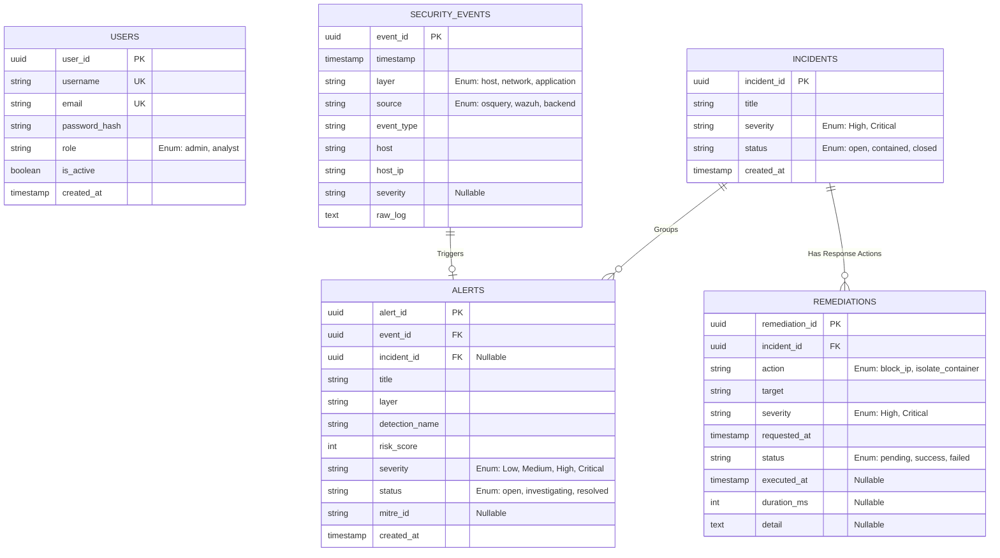

# AEGILON XDR Database Design (ERD) - Terbaru

Diagram Entity-Relationship (ERD) di bawah ini telah diperbarui untuk mencerminkan skema database terbaru Aegilon XDR.

## ERD (Entity-Relationship Diagram)

---

## Penjelasan Tabel & Relasi (Terbaru)

1. **USERS (`users`)**
   - **Fungsi:** Menyimpan data kredensial pengguna dashboard.
   - **Kolom Kunci:** `user_id` (UUID, Primary Key).
   - **Penjelasan:** Role berbasis RBAC hanya ada `admin` dan `analyst`. Kolom `password_hash` diamankan menggunakan bcrypt.

2. **SECURITY_EVENTS (`security_events`)**
   - **Fungsi:** Menyimpan data mentah dari telemetri Wazuh/Osquery yang telah dinormalisasi.
   - **Kolom Kunci:** `event_id` (UUID, Primary Key).
   - **Kolom Baru:** **`severity`** (String, Nullable) ditambahkan agar Backend dapat mencatat langsung tingkat keparahan awal dari log telemetri Wazuh/Osquery sebelum dianalisis oleh Detection Engine.
   - **Penjelasan:** Payload asli disimpan di kolom `raw_log` (Tipe Teks) untuk forensik.

3. **ALERTS (`alerts`)**
   - **Fungsi:** Menyimpan hasil deteksi anomali (*Detection Result*) dari Python Detection Engine. 
   - **Kolom Kunci:** `alert_id` (UUID, Primary Key).
   - **Kolom Baru:** **`mitre_id`** (String, Nullable) ditambahkan untuk menyimpan pemetaan taktik/teknik serangan berdasarkan framework MITRE ATT&CK (contoh: `T1046`, `T1059`).
   - **Relasi:** Terhubung ke `security_events` (1:1/0) dan `incidents` (N:1, Nullable).

4. **INCIDENTS (`incidents`)**
   - **Fungsi:** Wadah untuk mengkorelasikan beberapa Alert berstatus High/Critical menjadi satu insiden keamanan yang dapat diinvestigasi.
   - **Kolom Kunci:** `incident_id` (UUID, Primary Key).

5. **REMEDIATIONS (`remediations`)**
   - **Fungsi:** Menyimpan *Response History* dari modul OpenClaw (Module 5) seperti pemblokiran IP atau isolasi *container*.
   - **Kolom Kunci:** `remediation_id` (UUID, Primary Key).
   - **Relasi:** Terhubung ke `incidents` (N:1) untuk mencatat aksi mitigasi otomatis yang telah dijalankan.
